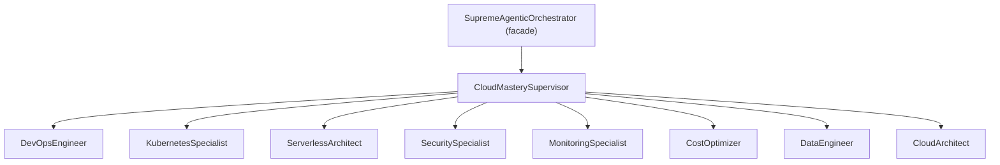

# Divine Agent System — Architecture

> The engineering blueprint behind the Supreme Agentic Orchestrator (SAO).
> Branding stays cinematic; the architecture is grounded in real,
> currently-supported technology (May 2026).

---

## 1. Goals

SAO is a multi-agent orchestration framework with three first-class goals:

1. **Composable agent hierarchy** — every department / agent is a real
   Python package on disk, auto-discovered, and addressable by stable name.
2. **Honest experimental features** — quantum sampling and "consciousness"
   reflection are real but flagged; they always have a deterministic
   fallback.
3. **Production runtime** — a single ASGI app (`uvicorn`), a single Compose
   stack (Postgres 16 + Redis 7.4 + Prometheus + Grafana + OTLP), and a
   single deploy driver (`deploy.py`) cover dev → prod.

---

## 2. Layered View

```
                            ┌────────────────────────┐
                            │  Clients (HTTP / WS /  │
                            │   JSON-RPC / CLI)      │
                            └───────────┬────────────┘
                                        │
                            ┌───────────▼────────────┐
                            │   FastAPI 0.115 ASGI   │
                            │   orchestrator.main    │
                            └───────────┬────────────┘
                                        │
                            ┌───────────▼────────────┐
                            │  DivineOrchestrator    │
                            │  (LangGraph 0.4 state  │
                            │   machine + reflect)   │
                            └───┬───────────────┬────┘
                                │               │
              ┌─────────────────▼──┐        ┌───▼──────────────┐
              │ SupremeAgenticOrchestrator│  │ Optional Qiskit  │
              │   (in-process facade)     │  │ Aer backend      │
              └─────────────┬─────────────┘  └──────────────────┘
                            │
       ┌────────────────────┼────────────────────────────────┐
       │                    │                                │
┌──────▼──────┐ ┌───────────▼──────────┐ ┌───────────────────▼──────────┐
│ cloud_mastery│ │ ai_supremacy …      │ │ web_mastery, quantum_mastery │
│ (9 agents)   │ │ (stubs, on disk)    │ │ (stubs, on disk)             │
└──────┬───────┘ └─────────────────────┘ └──────────────────────────────┘
       │
   ┌───▼───────────────────────────────────────────────┐
   │  Cross-cutting infra                              │
   │  • Postgres 16 (psycopg3) — durable state         │
   │  • Redis 7.4 Streams — message bus / async tasks  │
   │  • Pinecone / Chroma — vector memory              │
   │  • Supabase 2.10 — auth & policies                │
   │  • OpenTelemetry (OTLP) — traces / metrics        │
   │  • Prometheus + Grafana — dashboards              │
   └───────────────────────────────────────────────────┘
```

---

## 3. Department / Agent Discovery

Discovery is dynamic, file-system driven, and has no hard-coded list of
agents.  At import time `agents/__init__.py` walks `agents/` and registers
every sub-directory that contains agent directories with `agent.py`
modules in them.

```python
# agents/__init__.py (simplified)
for child in sorted(Path(__file__).parent.iterdir()):
    if not child.is_dir() or child.name.startswith(("_", ".")):
        continue
    agent_names = [
        sub.name for sub in child.iterdir()
        if sub.is_dir() and (sub / "agent.py").exists()
    ]
    register_department(child.name, agent_names)
```

Departments expose a uniform factory API:

```python
from agents.cloud_mastery import (
    DEPARTMENT_INFO, get_department_info,
    list_agents, get_agent_info,
    create_agent, create_rpc_agent, create_agent_instance,
)
```

`create_agent("devops_engineer")` returns a `DevOpsEngineer()`.
`create_rpc_agent("devops_engineer")` returns a `DevOpsEngineerRPC()` with
a JSON-RPC `handle_request` entry-point.

---

## 4. Cloud Mastery (fully implemented department)



Every concrete agent ships:

- An **async public API** with strongly-typed enum parameters (e.g.
  `DeploymentStrategy.ROLLING`, `WorkloadType.DEPLOYMENT`,
  `CostCategory.COMPUTE`).
- An **RPC wrapper** class (`<Agent>RPC`) with a `handle_request`
  JSON-RPC entry-point.
- A sync **statistics introspection** method (e.g.
  `get_devops_statistics()`).

The other ten departments have `__init__.py` packages and agent
directories on disk; their concrete classes are pending and
`create_agent()` raises `NotImplementedError` until they land.

---

## 5. Orchestrator State Machine

`orchestrator.main:DivineOrchestrator` walks through six phases:

```
INIT → DISCOVERING → WIRING → READY ⇄ REFLECTING → SHUTTING_DOWN
```

- **DISCOVERING** — walk the package tree, build an `AgentRecord` for every
  agent (with capabilities & RPC-enabled flag for implemented departments).
- **WIRING** — eagerly instantiate concrete agent classes so they're warm.
- **READY** — orchestrator is up; serve requests.
- **REFLECTING** — planner / critic loop runs over a candidate set; uses
  Qiskit-Aer when available, deterministic PRNG fallback otherwise.
- **SHUTTING_DOWN** — drain in-flight tasks, clear active agents.

`boot()`, `reflect(decision, options)`, `shutdown()`, and `status()` are
the entry-points.

---

## 6. Experimental Layers

### 6.1 Quantum Sampling

When `enable_quantum=True` and `qiskit-aer` is installed:

1. Build an N-qubit uniform-superposition circuit
   (`QuantumCircuit(N); circuit.h(range(N)); circuit.measure_all()`).
2. `transpile()` against `qiskit_aer.AerSimulator()`.
3. Run with `shots=1024` (default), interpret the most-frequent bitstring
   as the index into the candidate list.
4. Return the choice + the full histogram for auditability.

When Qiskit is not present, the backend falls back to a
`random.choice(options)` with the histogram set to `{}` and `method` set
to `"prng-fallback"` so callers can detect the degraded mode.

> **Honest scope:** this is genuine Qiskit-Aer simulation (not magic, not
> a real quantum computer). For real-hardware access, install
> `qiskit-ibm-runtime` and configure provider credentials separately.

### 6.2 Self-Reflection (the "consciousness" layer)

The reflection layer is a deterministic planner / critic:

- **Planner**: receives a decision name and a list of options. If the
  quantum backend is up, it samples; otherwise it picks at random.
- **Critic**: scores each option as `1 / (1 + position)`, mirroring a
  "trust the candidate list ordering" prior.
- **Consensus**: returns the planner pick if it agrees with the critic;
  otherwise yields to the critic. Both picks plus the full score map are
  returned, so the decision is fully auditable.

---

## 7. Transport & Protocols

| Channel              | Protocol                                  | Library                  |
|----------------------|-------------------------------------------|--------------------------|
| Public HTTP          | REST + OpenAPI 3.1                        | FastAPI 0.115            |
| Tool / agent calls   | Model Context Protocol (MCP) 1.2          | `mcp>=1.2.0`             |
| Inter-agent in-proc  | Direct method calls                       | -                        |
| Inter-agent out-proc | JSON-RPC over Redis 7.4 Streams           | `redis>=5.2.0`           |
| Telemetry            | OpenTelemetry OTLP (gRPC, port 4317)      | `opentelemetry-sdk`      |
| Realtime updates     | WebSocket (FastAPI built-in)              | Starlette 0.41           |

The `gRPC` references in earlier versions of this document have been
removed: SAO uses MCP + JSON-RPC over Redis as the canonical inter-agent
contract.

---

## 8. Data Layer

```
┌──────────────────────────────────────────────────────────────────────┐
│                          Application Layer                           │
└──────────┬───────────────────────┬───────────────────────────┬───────┘
           │                       │                           │
   ┌───────▼───────┐       ┌───────▼────────┐         ┌────────▼──────┐
   │  Postgres 16  │       │  Redis 7.4     │         │  Pinecone /   │
   │  (psycopg3)   │       │  Streams + KV  │         │  Chroma       │
   │  durable      │       │  bus / cache   │         │  vector mem   │
   └───────┬───────┘       └────────────────┘         └───────┬───────┘
           │                                                  │
   ┌───────▼───────┐                                  ┌───────▼───────┐
   │  Supabase 2.10│                                  │  Embeddings   │
   │  auth + RLS   │                                  │  (OpenAI v3)  │
   └───────────────┘                                  └───────────────┘
```

Postgres holds canonical state (deployments, pipelines, policies,
budgets, …). Redis carries the message bus and ephemeral caches.
Pinecone / Chroma hold the semantic memory used by the planner.

---

## 9. Security Architecture

- **Authn**: JWT (RS256) verified against a JWKS URL — no shared
  secrets in pods.
- **Authz**: department-scoped RBAC enforced in middleware before the
  agent dispatcher sees the request.
- **Transport**: TLS terminated at the ingress (`Caddy` / `Traefik` /
  cloud LB); in-cluster traffic uses mesh mTLS where available.
- **At rest**: AES-256-GCM (via the `cryptography` library) for any
  application-managed secrets; cloud provider KMS for blobs.
- **PQC awareness**: ML-KEM-768 / ML-DSA-65 (NIST FIPS-203 / FIPS-204)
  are surfaced in the `EncryptionAlgorithm` enum and tracked in
  `SecuritySpecialist`'s key-management surface. Not yet enforced
  on the wire as of May 2026; planned for Q4 2026.
- **Supply chain**: `pip-audit`, `trivy`, and SBOM generation wired into
  CI; container images signed with `cosign`.

Full posture and disclosure policy: see [SECURITY.md](SECURITY.md).

---

## 10. Observability

| Concern              | Tool                       | Version       |
|----------------------|----------------------------|---------------|
| Metrics              | Prometheus                 | v2.55         |
| Dashboards           | Grafana                    | 11.3          |
| Tracing              | OpenTelemetry → Jaeger     | OTLP 4317/4318, Jaeger 1.62 |
| Logs                 | Structured JSON + OTLP logs| -             |

Direct Jaeger client SDKs are no longer used; tracing is uniformly
exported via OpenTelemetry OTLP.  Jaeger acts as the collector + UI.

---

## 11. Deployment Architecture

### 11.1 Docker / Compose

`docker-compose.yml` is a Compose Spec v2 file (no top-level `version:`
key). Services:

- `sao` (the FastAPI app)
- `postgres` (16-alpine)
- `redis` (7.4-alpine)
- `prometheus` (v2.55)
- `grafana` (11.3)
- `jaeger` (1.62) with OTLP 4317/4318

Profiles:
- `--profile dev` enables a hot-reload uvicorn worker
- `--profile quantum` enables a Qiskit-Aer-equipped worker

### 11.2 Kubernetes

`deploy.py kubernetes` shells out to `kubectl` (verified via
`shutil.which`). A minimal deployment manifest:

```yaml
apiVersion: apps/v1
kind: Deployment
metadata:
  name: divine-agent-system
spec:
  replicas: 3
  selector:
    matchLabels: { app: divine-agents }
  template:
    metadata: { labels: { app: divine-agents } }
    spec:
      containers:
      - name: orchestrator
        image: kalivibecoding/sao:2.0.0
        ports: [{ containerPort: 8000 }]
        env:
        - { name: SAO_ENVIRONMENT, value: production }
        resources:
          requests: { memory: "2Gi", cpu: "1000m" }
          limits:   { memory: "4Gi", cpu: "2000m" }
        readinessProbe:
          httpGet: { path: /health, port: 8000 }
```

### 11.3 Multi-Cloud

`deploy.py multi-cloud` orchestrates per-provider deploys via the real
CLIs (`aws`, `az`, `gcloud`). Each invocation produces a `StepResult`;
a `--json` flag emits a single `DeployReport` for downstream
consumption.

---

## 12. Testing Strategy

`test_system.py` (the canonical suite, 13 tests, ~22 s):

- **01–02**: package metadata + department registry
- **03–08**: one per concrete cloud-mastery specialist, exercising the
  real async API with proper enum-typed arguments
- **09**: RPC wrappers expose `handle_request` JSON-RPC entry-points
- **10**: experimental quantum / reflection hooks are present
- **11**: `SupremeAgenticOrchestrator` facade lifecycle
- **12**: CLI plumbing (argparse + YAML config loader)
- **13**: `DivineOrchestrator.boot()` + `reflect()` + `shutdown()`

External I/O is deliberately mocked or in-memory so the suite runs in
CI without secrets.

---

## 13. Roadmap

| Quarter   | Theme                                                                |
|-----------|----------------------------------------------------------------------|
| Q2 2026   | Wire concrete classes for `web_mastery`, `data_omniscience`          |
| Q3 2026   | LangGraph 0.5 migration; MCP 1.3 (streamable tool I/O)               |
| Q4 2026   | ML-KEM-768 transport for inter-agent messaging                       |
| Q1 2027   | `quantum_mastery` department: real `qiskit-ibm-runtime` integration  |
| Q2 2027   | RL planner inside the reflection loop (Stable-Baselines3 + LangGraph)|
| H2 2027   | Federated SAO clusters (cross-region, cross-cloud)                   |

---

## 14. The Architect

**Rick Jefferson** — *KaliVibeCoding*

> "Branding can stay cinematic. The engineering has to be honest."

---

*Architecture document, version 2.0.0 — last refreshed 2026-05-14.*
